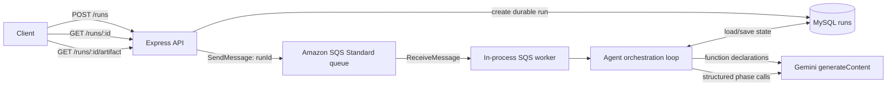
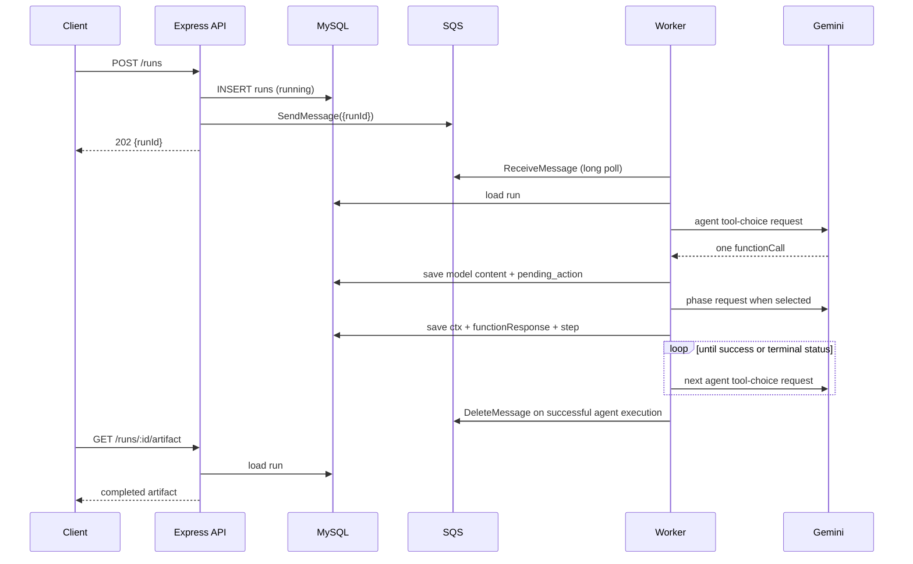

# Meta-Analysis MVP — Implementation Reference PRD

## 1. Document status

This document is the implementation-accurate reference for the current project on the `gemini-migration` branch. It describes what the code does today, rather than the earlier OpenAI/no-queue proposal.

Implemented: Node.js/Express API, MySQL durable run state, Amazon SQS job delivery, direct Gemini REST calls, an agentic three-phase workflow, deterministic validation, recovery scanning, Pino logs, and focused Vitest tests.

Not implemented: Portkey, S3 output storage, phases four and five, authentication, authorization, automatic SQS/DLQ provisioning, distributed run leases, graceful shutdown, deployment infrastructure, and end-to-end tests against live AWS, MySQL, or Gemini.

## 2. Purpose and scope

The MVP demonstrates an agentic, durable meta-analysis workflow over an interview transcript and a Business Model Canvas (BMC) hypothesis map. A model does not directly execute code. Instead, it selects one function-like tool at a time, the application persists that choice before execution, runs the selected phase or validator, stores the result, and sends a function response back to the model for the next decision.

The main learning goals are:

- agentic tool selection and controlled tool execution;
- phase-specific Gemini structured JSON generation;
- deterministic validation separate from model generation;
- retry hints chosen by the agent but hard limits enforced by runtime code;
- MySQL-backed state that can resume after a process interruption;
- SQS-based asynchronous processing with one in-process worker and visible structured logs.

## 3. Technology choices

| Area | Implemented choice | Role |
|---|---|---|
| Runtime | Node.js, ESM | No build step; native `fetch` for Gemini |
| HTTP | Express | Receives and retrieves analysis runs |
| LLM | Gemini `generateContent` REST API | Agent tool selection and phase structured output |
| Agent runtime | Custom `while` loop | Makes orchestration mechanics explicit |
| Queue | Amazon SQS Standard queue | Delivers durable `{ runId }` work messages |
| Durable state | MySQL 8/InnoDB | Stores complete run state in one `runs` table |
| DB access | `mysql2/promise` | Direct SQL; no ORM |
| Validation | Zod + plain JavaScript | HTTP/environment validation plus domain validation |
| Logging | Pino | Structured stdout lifecycle logs |
| Tests | Vitest | Unit and workflow tests with mocked integrations |

The project deliberately does not use an AI SDK, agent framework, ORM, Portkey, S3, or a separate worker process.

## 4. High-level architecture



`npm start` launches the API and the SQS worker in the same Node process. Their Pino output therefore appears in one terminal. SQS itself is an AWS-managed external service.

## 5. Components and responsibilities

| Location | Responsibility |
|---|---|
| `src/index.js` | Validates required runtime config, checks MySQL, runs stale-run recovery, starts SQS worker and Express |
| `src/app.js` | Creates Express and mounts `/runs` routes plus error/not-found middleware |
| `src/modules/runs` | Input validation, controllers, routes, run creation, response shaping, MySQL store, recovery scan |
| `src/modules/queue` | SQS send/receive/delete/visibility methods and the worker loop |
| `src/orchestration/agent-loop.js` | Tool-selection loop, write-ahead state, caps, dispatch, terminal handling |
| `src/modules/agent` | Agent system prompt and Gemini function declarations |
| `src/modules/analysis` | Phase input construction, schemas, prompts, report composition, and validators |
| `src/modules/gemini` | Raw Gemini REST requests, retry, timeout, and response extraction |
| `src/db/mysql` | Pool, SQL migration, and an unused transaction helper |
| `src/config` | Zod-loaded process configuration and derived config objects |

## 6. HTTP API

### `POST /runs`

Creates a run, persists it, and queues the run ID. It does not wait for the model workflow.

Request body:

```json
{
  "turns": [
    {
      "turn": 1,
      "speaker": "speaker_1",
      "sentences": {
        "0": "We usually order groceries on Sunday.",
        "1": "Price matters more than delivery speed."
      }
    }
  ],
  "bmc": {
    "h0": "Urban professionals who order groceries weekly",
    "h1": "Price is the primary purchase driver"
  }
}
```

Validation requirements: `turns` is a non-empty array; every turn has a non-negative integer `turn`, non-empty `speaker`, and string-valued `sentences`; `bmc` is a non-empty string map.

Successful response:

```http
202 Accepted
```

```json
{ "runId": "uuid" }
```

Malformed input returns `400` with `{ "error": "invalid request", "details": [...] }`. If persistence or SQS enqueue fails, the generic error middleware returns `500`. A row may already exist if MySQL insertion succeeds but SQS enqueue fails; there is no compensating transaction or enqueue retry at this boundary.

### `GET /runs/:id`

Returns polling state:

```json
{
  "runId": "uuid",
  "status": "running",
  "attempts": { "phase1": 1, "phase2": 0, "phase3": 0 },
  "step": 2,
  "artifact": null,
  "error": null
}
```

The status is one of `running`, `success`, `aborted`, or `failed`. Unknown IDs return `404`.

### `GET /runs/:id/artifact`

Returns only the completed final artifact:

```json
{
  "runId": "uuid",
  "artifact": {
    "thematicAnalysis": {},
    "keyInsights": {},
    "executiveSummary": "...",
    "metaInsights": [],
    "analysis": [],
    "completedAt": "2026-...Z"
  }
}
```

It returns `409 { "error": "artifact is not ready", "status": "running|failed|aborted" }` until success, and `404` for an unknown ID.

## 7. Request-to-result workflow



## 8. SQS integration

The producer sends only `{ "runId": "..." }`; transcript and analysis data remain in MySQL. The queue is an externally created AWS SQS Standard queue. The code does not create a queue or DLQ.

| Setting | Default | Behavior |
|---|---:|---|
| Long poll | 20 seconds | `ReceiveMessage` waits for a message |
| Batch size | 1 | One in-process worker processes one message at a time |
| Visibility timeout | 300 seconds | Initial invisible period after receive |
| Heartbeat | 120 seconds | Worker calls `ChangeMessageVisibility` while running |
| Success | delete message | Deletes after `runAgent` resolves |
| Failure | do not delete | SQS redelivery/DLQ policy controls retry |

Recommended operational setup, but not provisioned by this repository: attach a DLQ with a redrive policy after three receives. SQS Standard delivery is at-least-once, so the same run message can be delivered again. The phase call ID replay checks help, but multi-worker/duplicate-delivery locking is not implemented.

## 9. Durable run model

The migration in `src/db/mysql/migrations/001-create-runs.sql` creates one InnoDB table:

| Column | Meaning |
|---|---|
| `run_id` | UUID generated by `crypto.randomUUID()` |
| `status` | `running`, `success`, `aborted`, or `failed` |
| `input` | Original `{ turns, bmc }` body |
| `messages` | Gemini conversation content: initial user data, model function calls, and user function responses |
| `ctx` | Stored phase results and validation results |
| `attempts` | Counters for `phase1`, `phase2`, and `phase3` |
| `pending_action` | Write-ahead selected `{ callId, name, args }` |
| `step` | Completed tool result count |
| `artifact` | Final artifact on success |
| `error` | Structured failure/abort reason |
| timestamps | Creation, mutation, stale-run scan support |

All JSON columns are serialized/deserialized by `run-db.service.js`. The migration must be applied manually; startup checks connectivity but does not invoke the migration executor.

### Initial state

```json
{
  "status": "running",
  "ctx": {
    "phase1": null,
    "phase1Validation": null,
    "phase2": null,
    "phase2Validation": null,
    "phase3": null,
    "phase3Validation": null
  },
  "attempts": { "phase1": 0, "phase2": 0, "phase3": 0 },
  "pendingAction": null,
  "step": 0
}
```

## 10. Agent orchestration

Each orchestration turn calls Gemini with the system prompt, persisted `messages`, eight function declarations, and `toolConfig.functionCallingConfig.mode = "ANY"`. The runtime still rejects any response that does not contain exactly one known function call.

Tool catalog:

| Tool | Runtime action |
|---|---|
| `run_phase_1` | Calls Phase 1 Gemini structured output |
| `validate_phase_1` | Runs deterministic Phase 1 validator |
| `run_phase_2` | Calls Phase 2 Gemini structured output |
| `validate_phase_2` | Runs deterministic Phase 2 validator |
| `run_phase_3` | Calls Phase 3 Gemini structured output |
| `validate_phase_3` | Runs deterministic Phase 3 validator |
| `finalize` | Builds success artifact only after all validators are `ok` |
| `abort_non_retryable` | Stores an `aborted` error record |

The prompt instructs the model to use the phase order: run → validate for each phase, then finalize. The model supplies `retryHint` for phase tools. Validator issues are included in the prior `functionResponse`, so the agent can choose a retry. The runtime—not the model—owns hard caps.

### Write-ahead protocol

1. Load current run.
2. Ask Gemini for one tool selection unless `pending_action` exists.
3. Persist Gemini model content, `pending_action`, and incremented phase attempt counter.
4. Execute the selected tool.
5. Persist changed `ctx`, a Gemini `functionResponse`, terminal fields if any, clear `pending_action`, and increment `step`.

If a process stops after step 3, recovery executes the saved action before another agent decision. If a phase model response arrives but the process stops before step 5, the phase call can be replayed; this is at-least-once, not exactly-once, external model execution.

### Limits and terminal behavior

- `MAX_STEPS` defaults to 20. Reaching it marks the run `failed` with `MAX_STEPS`.
- `MAX_ATTEMPTS_PER_PHASE` defaults to 3. A fourth selected phase call does not invoke Gemini; it returns a synthetic cap issue to the agent.
- Unknown tool, malformed function arguments, or an invalid function-call count fail the run.
- `finalize` before three successful validations returns a tool result with an issue and leaves the run running.

## 11. Phase contracts

Prompt strings are local source files and can be replaced with approved prompts. No Portkey prompt IDs are used.

### Phase 1 — thematic analysis and key insights

Input to Gemini is a JSON object containing only:

```json
{ "json_transcript": "<JSON.stringify(turns)>" }
```

Required output:

```json
{
  "thematicAnalysis": { "themes": [{ "themeTitle": "...", "summary": "..." }] },
  "keyInsights": {
    "explicit": [{ "insightSummary": "...", "sectionId": "explicit_1" }],
    "implicit": [{ "insightSummary": "...", "sectionId": "implicit_1" }]
  },
  "executiveSummary": "..."
}
```

`sectionId` is permitted but not required in the Phase 1 structured schema. Phase 3 report composition adds missing IDs deterministically.

The validator requires at least one theme, non-empty title/summary fields, array-valued explicit/implicit insight lists, non-empty insight summaries, and a non-empty executive summary.

### Phase 2 — meta-level insights

Input:

```json
{
  "json_transcript": "<JSON.stringify(turns)>",
  "thematic_analysis": "<JSON.stringify(phase1.thematicAnalysis)>"
}
```

Required output:

```json
{
  "metaInsights": [{
    "shortExplanation": "...",
    "strategicImplication": "...",
    "suggestedReframe": "..."
  }]
}
```

The validator requires an array and non-empty strings for all three fields on each item. It does not require that the array itself be non-empty.

### Phase 3 — canvas-grounded analysis

Before the call, `buildAnalysisReport` removes Phase 1 thematic analysis from the handoff and builds:

```json
{
  "keyInsights": { "explicit": [], "implicit": [] },
  "metaInsights": [],
  "executiveSummary": "..."
}
```

Missing section IDs are assigned in list order: `explicit_1`, `implicit_1`, and `meta_1` onward. Gemini receives:

```json
{
  "Analysis_Report": "<JSON.stringify(composed report)>",
  "BMC_JSON": "<JSON.stringify(bmc)>"
}
```

Required output has an `analysis` array. Each parent analysis contains a known `sectionId`, parent title/text, integer `importance` from 1 to 5, hypothesis links, and child insights. Each child includes `turn`, `sentenceStart`, `sentenceEnd`, analysis text, integer importance, and links.

The deterministic Phase 3 validator verifies section IDs, BMC hypothesis IDs, importance range, existing turn IDs, and sentence coordinate endpoints. It does not validate semantic truth, quote fidelity, completeness of coverage, support-status vocabulary, or whether every expected section appears exactly once.

## 12. Gemini integration

All requests use native `fetch` against:

```text
POST https://generativelanguage.googleapis.com/v1beta/models/{model}:generateContent
x-goog-api-key: {GEMINI_API_KEY}
```

Agent calls include function declarations and `ANY` mode. Phase calls omit tools and use Gemini JSON output settings:

```json
{
  "generationConfig": {
    "responseMimeType": "application/json",
    "responseJsonSchema": { "...": "phase schema" }
  }
}
```

The Gemini client retries network errors, HTTP `429`, and HTTP `5xx` using exponential backoff beginning at 250 ms, up to `GEMINI_MAX_RETRIES`. Other Gemini HTTP failures are non-retryable at the client layer. Each request has an `AbortController` timeout; default is four minutes (240,000 ms). API keys are sent only in the request header and are not intentionally logged.

## 13. Recovery, errors, and edge cases

At boot, `recoverRuns` selects rows with `status = 'running'` and an `updated_at` older than `RECOVERY_STALE_SECONDS` (30 by default), then invokes the agent loop directly. This recovery path does not enqueue a fresh SQS message.

| Situation | Current behavior |
|---|---|
| Process stops with `pending_action` | Recovery reruns/reuses that action before a new model choice |
| Same phase call ID reappears | Stored phase output is reused without another phase call |
| Gemini call fails | Error bubbles out of the agent; SQS worker logs it and leaves message for redelivery |
| SQS worker cannot poll | Logs `sqs_worker_poll_failed`, sleeps one second, retries |
| Visibility heartbeat fails | Logs failure; processing continues, so duplicate delivery becomes possible |
| Malformed SQS body | Worker logs an error and leaves the message undeleted |
| Queue send fails after run insert | API returns 500; stored run remains for stale recovery later |
| Invalid HTTP body | Zod error middleware returns 400 |
| Unknown route | Returns 404 `{ "error": "not found" }` |

## 14. Configuration and local setup

Copy `.env.example` to `.env` and configure:

| Variable group | Important variables |
|---|---|
| Gemini | `GEMINI_API_KEY`, agent/phase model names, retry count, timeout |
| AWS/SQS | `AWS_REGION`, `SQS_QUEUE_URL`, visibility, heartbeat, long-poll values |
| MySQL | host, port, user, password, database, pool size |
| Runtime | port, step/attempt caps, stale threshold, log level |

The AWS SDK uses its normal credential-provider chain, such as local `aws configure` credentials or an AWS IAM role. The repository does not create IAM roles, queues, DLQs, or MySQL databases.

Apply the schema manually:

```bash
mysql -u meta_analysis -p meta_analysis_mvp < src/db/mysql/migrations/001-create-runs.sql
```

Then run:

```bash
npm install
npm start
```

## 15. Logging and observability

Pino writes JSON logs to stdout. Common events include `server_started`, `run_created`, `sqs_job_enqueued`, `sqs_message_received`, `sqs_visibility_extended`, `agent_request_started`, `pending_action_saved`, `tool_result_saved`, `sqs_message_deleted`, `sqs_job_failed`, and `recovery_run_adopted`.

Run logs are commonly enriched with `runId`, step, tool, and SQS message ID. Full transcripts and API keys are not intentionally logged. There is no metrics endpoint, tracing exporter, log retention configuration, or CloudWatch integration in code.

## 16. Security and operational considerations

This is an MVP, not a production-hardening baseline.

- No authentication, authorization, tenant isolation, API rate limiting, CORS policy, or audit trail exists.
- Request JSON is limited to 1 MB; there are no transcript-content safety controls.
- Keep `.env` out of source control and use least-privilege IAM permissions for `SendMessage`, `ReceiveMessage`, `DeleteMessage`, and `ChangeMessageVisibility` on the selected queue.
- Protect MySQL credentials and use private networking/TLS according to the deployment environment; the current code does not configure TLS itself.
- SQS Standard may redeliver messages. The application has replay checks but no distributed lease, row lock, or `SKIP LOCKED` claim protocol.
- The SQS worker has no graceful shutdown handler; terminating the process may leave a message invisible until visibility expires.

## 17. Test coverage

`npm test` currently runs focused, mocked tests for:

- input validation;
- run persistence-before-enqueue ordering;
- artifact endpoint success and not-ready responses;
- SQS enqueue payload and worker deletion after success;
- phase validators;
- normal agent workflow, retry hint propagation, hard limits, write-ahead recovery, and stale-run adoption.

Tests do not contact live Gemini, AWS SQS, or MySQL. There is no browser UI, load test, live integration test, or migration test suite.

## 18. Planned or incomplete work

| Item | Status |
|---|---|
| Paste approved detailed prompts into the three local prompt files | TBD by project owner |
| S3 phase outputs and execution-summary persistence | Not implemented |
| Phase 4 and Phase 5 | Not implemented |
| Separate SQS queue/job per phase | Not implemented; current queue starts one full agent run |
| Automated SQS/DLQ/IAM provisioning | Not implemented |
| Distributed locking/worker leases | Not implemented |
| SQS queue health, DLQ inspection, and metrics | Not implemented |
| Graceful shutdown and worker draining | Not implemented |
| Authentication, authorization, and rate limits | Not implemented |
| Live integration tests | Not implemented |

## 19. Reading order

1. `README.md` and this PRD
2. `src/db/mysql/migrations/001-create-runs.sql`
3. `src/index.js`
4. `src/modules/runs/run.service.js` and `src/modules/queue/sqs.worker.js`
5. `src/orchestration/agent-loop.js`
6. `src/modules/agent/schemas/tool.schemas.js`
7. Phase service, prompt, schema, and validator directories
8. `src/modules/runs/services/run-db.service.js`
9. Tests under `tests/`
